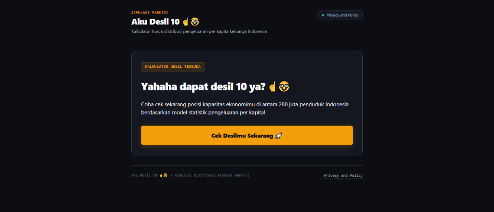
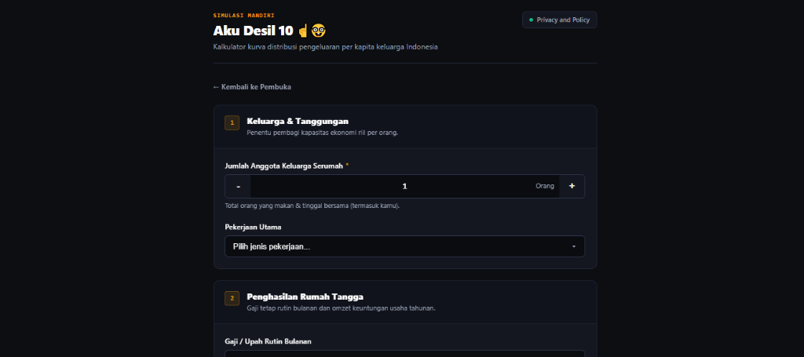

# Aku Desil 10 ☝️🤓

[-emerald.svg)](SECURITY.md)

🌐 **Akses Langsung Aplikasi (Live Demo):** [https://helggaa.github.io/Aku-Desil-10/](https://helggaa.github.io/Aku-Desil-10/)

> **📌 Penafian Resmi (Disclaimer):**  
> Aplikasi ini adalah alat **simulasi & estimasi statistik mandiri** untuk tujuan edukasi dan literasi data publik. Aplikasi ini **tidak berafiliasi dengan lembaga pemerintah mana pun** (Kemensos, BPS, DTSEN, dll.), tidak menggunakan data identitas individu resmi pemerintah, dan tidak dapat digunakan sebagai dasar penetapan maupun pencabutan program bantuan sosial atau subsidi resmi.

---

## 📸 Antarmuka Aplikasi

  
  
<em>Halaman Pembuka (Opening View)</em>

  
   
  
  
  
<em>Halaman Formulir Input Data Ekonomi (Form View)</em>

---

## 🌟 Latar Belakang & Tujuan

Banyak warga masyarakat yang bingung atau mengalami salah klasifikasi desil ekonomi oleh sistem algoritma tertutup pemerintah (*proxy-means testing*), di mana variabel semu (seperti mewarisi rumah tua keluarga atau memiliki 1 motor tua untuk bekerja) kerap langsung menggelembungkan skor desil menjadi Desil 9–10 padahal daya beli per kapita riilnya sangat terbatas.

**Aku Desil 10** hadir sebagai kalkulator mandiri yang **100% transparan, objektif, dan privat**:
- Menghitung **kapasitas ekonomi riil per kapita** (pendapatan bulanan dibagi seluruh anggota keluarga yang ditanggung).
- Memisahkan **Aset Index** secara mandiri agar kepemilikan fisik tidak mendistorsi desil pengeluaran rutin bulanan.
- Menampilkan visualisasi kurva distribusi populasi 280 juta jiwa Indonesia secara interaktif.

---

## ✨ Fitur Utama

- **Alur 3 Halaman Terstruktur (*3-Phase Multi-View Flow*)**:
  1. **Halaman Pembuka (*Opening*)**: Pengantar ringkas & ajakan cek desil.
  2. **Halaman Formulir (*Form*)**: Pengisian data demografi, upah, usaha, dan aset dengan kontrol taktil (*steppers* `+`/`-` dan *quick preset chips*).
  3. **Halaman Hasil (*Results*)**: Dashboard analisis dengan kurva lonceng interaktif, skala 10 segmen, dan matriks finansial.
- **Visualisasi Kurva Distribusi Populasi (Interactive SVG Bell Curve)**:
  - Memetakan posisi persentil ($\Phi(z)$) pengguna secara dinamis dengan penanda pin *"Kamu di Sini"*.
  - Dilengkapi garis acuan Garis Kemiskinan Nasional (Rp 641rb) dan Median Nasional (Rp 1.01jt).
- **Perlindungan Scroll Roda Mouse (*Scroll-Wheel Protection*)**:
  - Mencegah perubahan nilai angka input saat pengguna melakukan *scroll* halaman dengan trackpad atau mouse wheel.
- **Tombol Cepat Nilai Aset (*Quick Preset Chips*)**:
  - Tombol instan untuk mobil (*100 Jt, 200 Jt, 500 Jt, 1 M*), motor (*8 Jt, 10 Jt, 15 Jt, 20 Jt, 35 Jt+*), gadget, laptop, dan tabungan.
- **Privacy by Absence (100% Client-Side)**:
  - ❌ Tidak ada backend / server API.
  - ❌ Tidak ada cookies, `localStorage`, atau `sessionStorage`.
  - ❌ Tidak ada analytics, pelacak pihak ketiga, atau remote CDN.
  - ❌ Tidak meminta data pribadi identitas (Nama, NIK, No HP, Alamat).

---

## 📐 Metodologi & Kalibrasi Statistik

### 1. Kapasitas Ekonomi Per Kapita
$$\text{Kapasitas Per Kapita} = \frac{\text{Gaji Bulanan} + \left(\frac{\text{Laba Bersih Usaha Tahunan}}{12}\right)}{\text{Jumlah Anggota Keluarga}}$$

### 2. Model Distribusi Lognormal BPS Susenas
Distribusi pengeluaran penduduk Indonesia dimodelkan melalui fungsi probabilitas kumulatif (*Cumulative Distribution Function* - CDF) lognormal:
$$\ln(X) \sim \mathcal{N}(\mu, \sigma)$$

**Parameter Kalibrasi**:
- $\mu = 13.8265$
- $\sigma = 0.328$

**Titik Jangkar Data BPS**:
- **Garis Kemiskinan Nasional**: Rp 641.443/kapita/bulan = persentil ke-8,25.
- **Rata-rata Pengeluaran Per Kapita**: Rp 1.066.833/bulan (Rp 12.802.000/tahun).

### 3. Batas Desil Pengeluaran Nasional (IDR/Bulan/Kapita)
| Desil | Batas Bawah | Batas Atas | Kategori |
|---|---|---|---|
| **Desil 1** | Rp 0 | Rp 664.000 | 10% Terbawah (Prioritas Bansos) |
| **Desil 2** | Rp 664.000 | Rp 767.000 | Rentan Miskin |
| **Desil 3** | Rp 767.000 | Rp 851.000 | Menengah-Bawah |
| **Desil 4** | Rp 851.000 | Rp 931.000 | Menengah-Bawah |
| **Desil 5** | Rp 931.000 | Rp 1.011.000 | Median Nasional (50% Tengah) |
| **Desil 6** | Rp 1.011.000 | Rp 1.099.000 | Menengah |
| **Desil 7** | Rp 1.099.000 | Rp 1.201.000 | Menengah Mapan |
| **Desil 8** | Rp 1.201.000 | Rp 1.333.000 | 20% Teratas |
| **Desil 9** | Rp 1.333.000 | Rp 1.539.000 | Mapan Atas |
| **Desil 10 ☝️🤓** | > Rp 1.539.000 | $\infty$ | 10% Teratas (Sultan Statistik) |

### 4. Formula Pembobotan Aset Index
$$\begin{aligned}
\text{Aset Index} = & \;(\text{Luas Rumah} \times 500.000) + (\text{Luas Tanah Lain} \times 300.000) \\
& + (\text{Mobil} \times \text{Nilai Mobil} \times 0.1) + (\text{Motor} \times \text{Nilai Motor} \times 0.1) + (\text{Kendaraan Lain} \times 0.1) \\
& + (\text{HP} \times \text{Nilai HP} \times 0.2) + (\text{Laptop} \times \text{Nilai Laptop} \times 0.2) + (\text{Elektronik} \times 0.2) \\
& + (\text{Emas \& Tabungan} \times 0.5)
\end{aligned}$$

---

## 🚀 Cara Menjalankan

### A. Buka Langsung (Lokal)
Cukup buka file `index.html` di peramban web modern apa pun (*Chrome, Firefox, Safari, Edge*). Tidak memerlukan instalasi, dependensi `npm`, maupun server backend.

### B. Akses GitHub Pages
Website aktif dan dapat langsung dibuka di:  
👉 **[https://helggaa.github.io/Aku-Desil-10/](https://helggaa.github.io/Aku-Desil-10/)**

Jika melakukan *fork* atau *re-deploy*:
1. Buka menu **Settings** > **Pages** di repositori GitHub.
2. Pada bagian **Build and deployment**, pilih Source: **Deploy from a branch** > Branch: `main` > Folder: `/ (root)` > **Save**.

---

## 📜 Lisensi
Didistribusikan di bawah Lisensi [MIT](LICENSE). Dibuat untuk transparansi publik dan edukasi literasi ekonomi Indonesia.
